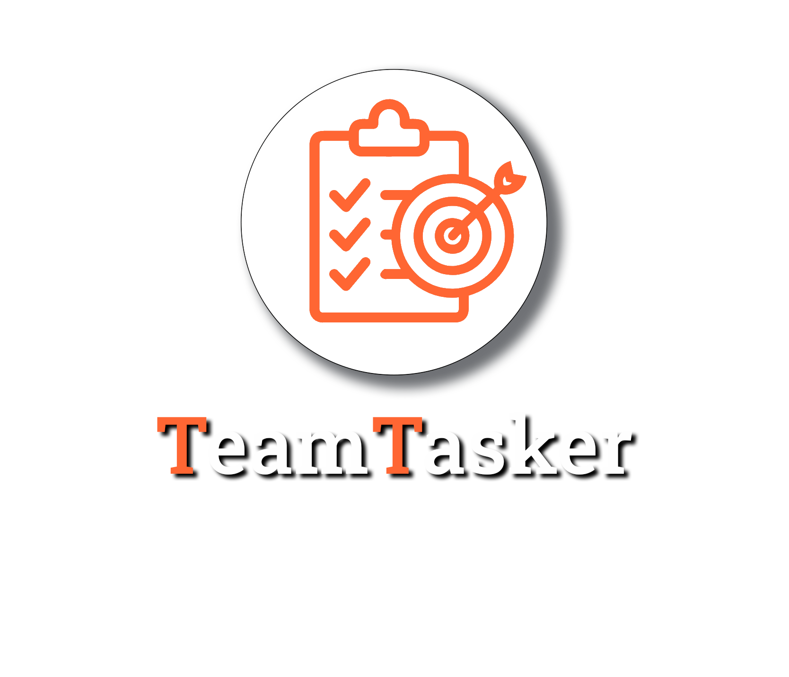

   
   <h1>Aplikacja do Zarządzania Projektami</h1>

   <li>Jakub Nowak</li>
   <li>Grzegorz Baryła</li>
   <li>Paweł Trojnar</li>
   <li>Jakub Janas</li>

## [Wersja poglądowa online](https://teamtaskerclient.azurewebsites.net)

## [Czym jest TeamTasker?](https://github.com/JakubNovvak/TeamTasker/wiki/Strona-g%C5%82%C3%B3wna-projektu#czym-jest-teamtasker)

## [Funkcjonalności projektu](https://github.com/JakubNovvak/TeamTasker/wiki/Strona-g%C5%82%C3%B3wna-projektu#poni%C5%BCej-znajduje-si%C4%99-lista-funkcjonalno%C5%9Bci-sk%C5%82adaj%C4%85cych-si%C4%99-na-aplikacj%C4%99)

## [Dokumentacja techniczna](https://github.com/JakubNovvak/TeamTasker/wiki/Dokumentacja-techniczna)

## [Dokumentacja użytkownika](https://github.com/JakubNovvak/TeamTasker/wiki/Dokumentacja-użytkownika)

## [Domyślne konta projektu](https://github.com/JakubNovvak/TeamTasker/wiki/Domyślne-konta-projektu)
